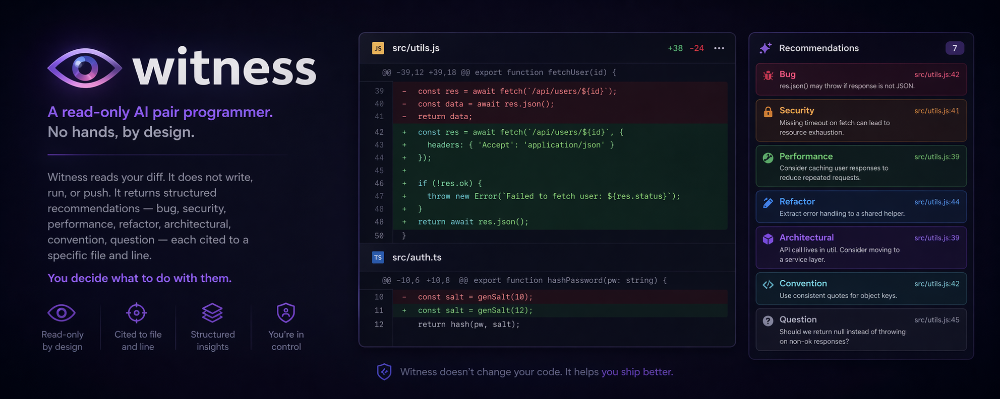

<p align="center">
  
</p>

# witness

A read-only AI pair programmer. No hands, by design.

Witness reads what you wrote and tells you what's wrong with it.
Six stages ship today (stage 7 — production trace review — deferred):

- **Diff review** — read a git diff, return structured recommendations
  (`bug`, `security`, `performance`, `refactor`, `architectural`,
  `convention`, `question`) each cited to a specific file and line.
- **Spec review** — read a PRD, spec, or ADR markdown file, return
  findings against six kinds (`missing-section`, `ambiguity`,
  `untestable-claim`, `scope-creep`, `broken-reference`,
  `undefined-term`) each cited to a line.

Same harness: N parallel SDK samples, voted, dissent log. Witness does
not write, run, or push. You decide what to do with the findings.

> **Status: personal experiment, not actively maintained.** The repo
> is public for inspection and for anyone who wants to fork it — what's
> here is what works for the author. Issues and PRs are not being
> triaged. License is MIT, so do what you like with the code.

> The shape is deliberate. In Bostrom's taxonomy, an **Oracle** answers
> questions; a **Genie** executes instructions; a **Sovereign** pursues
> open-ended goals. Witness is an Oracle in that sense: it observes and
> reports. The riskier categories are already well-served. This one isn't.

## Design thesis

Minimal scaffolding. The product is the model, plus the smallest
possible wrapper to:

1. Give it a reliable structured output format.
2. Vote across multiple samples so low-confidence noise doesn't reach you.
3. Constrain its tools to the read-only set (Read + Grep, plus Glob for the diff stage).
4. Log your dissent so we can learn where it's wrong.

Everything else is a temporary ladder that a better model kicks out
from under itself. We will remove it when we can.

## Install

```bash
pnpm install
```

Requires Node 20+.

### Authentication

Witness defaults to the [Claude Agent SDK](https://www.npmjs.com/package/@anthropic-ai/claude-agent-sdk).
The SDK handles auth; we don't. You have two options:

```bash
# preferred — uses your Claude Pro/Max subscription, zero per-call cost
claude login

# alternative — pay-as-you-go via API credits
export ANTHROPIC_API_KEY=sk-ant-...
```

If `claude login` has been run, the SDK picks that up automatically. If not,
it falls back to the env var. If neither is configured, Witness will tell you
exactly which command to run.

For the Codex backend, authenticate Codex separately:

```bash
codex login
```

> **Note on Claude subscription usage.** Using your subscription token to
> power a third-party CLI is allowed by the SDK; Anthropic's terms may evolve
> and are on you to respect. If you're redistributing Witness or running it
> inside a commercial product, set `ANTHROPIC_API_KEY` instead.

## Use

```bash
# review your uncommitted diff against HEAD
pnpm witness

# review staged changes only
pnpm witness --staged

# review the diff from main..HEAD
pnpm witness --range main

# review a pre-built patch file (must live inside the repo)
pnpm witness --diff ./some.patch

# or pipe an external patch on stdin
git format-patch -1 --stdout | pnpm witness --diff -

# review with Codex instead of the Claude Agent SDK
pnpm witness --backend codex

# machine-readable output
pnpm witness --json
```

For workflow recipes, failure modes, and honest weaknesses, see [USAGE.md](./USAGE.md).

Flags:

| flag | default | purpose |
|---|---|---|
| `--samples <n>` | 5 | model samples to vote across |
| `--min-votes <n>` | 2 | drop findings below this vote count |
| `--max-turns <n>` | 40 | Claude per-sample tool-use turn cap (Claude backend only) |
| `--backend <name>` | `claude` | reviewer backend: `claude` or `codex` |
| `--model <id>` | `claude-opus-4-7` | override model (omit on codex to use codex's configured default) |
| `--budget <usd>` | $10 (subscription) / $1 (API key), auto-detected | Claude per-sample USD cap (Claude backend only). See [USAGE.md](./USAGE.md#about---budget-and-the-two-auth-modes) for the auth-aware default rationale. |
| `--auth <mode>` | `auto` | `auto \| subscription \| api-key`. Override auth detection (and the budget default it picks) |
| `--json` | off | machine output for editor/PR-bot integration |
| `--quiet`, `-q` | off | suppress progress output on stderr |
| `--force` | off | skip the large-diff safety rail on unborn-HEAD repos |

### How context gets collected

Witness doesn't pre-bundle your codebase. Each sample is a fresh agent session
rooted at your repo. With the default Claude backend, the session has only
read-only `Read`, `Grep`, and `Glob` tools. With `--backend codex`, Witness
shells out to `codex exec` with `--sandbox read-only` and schema-constrained
output. In both cases, the model decides what context to inspect before
returning structured findings.

## Use with Claude Code

Witness pairs naturally with Claude Code: Claude Code is a Genie (writes,
executes); Witness is an Oracle (reads, reports). The trust separation is the
point — Witness can review *any* write-capable agent's diffs (Claude Code,
Cursor, Codex, an MCP workflow, a teammate's PR) without ever needing
the same trust level as the agent that produced them.

The cheapest integration is a slash command. Drop this at
`.claude/commands/review.md` in any project:

```markdown
---
description: Review staged changes with Witness before commit
---

Below is the output of `witness --staged` against the current diff. Read
it carefully and present the findings to the user. If Witness raises
anything, ask whether to address it before committing.

!`witness --staged`
```

Then `/review` inside Claude Code runs Witness against your staged diff and
threads the findings into the conversation. Variants: swap `--staged` for
`--range main` to review the whole branch, or for `--diff <file>` to review a
specific patch.

For tighter loops you can wire Witness as a git pre-commit hook, an MCP
server, or a `PostToolUse` hook — same CLI, different trigger.

## Use with Codex

Witness can also run its reviewer samples through Codex:

```bash
pnpm witness --backend codex
pnpm witness --backend codex --staged
pnpm witness --backend codex --range main
```

The Codex backend keeps Witness's structured schema, voting, JSON output, and
eval harness. It uses your local Codex configuration by default; pass
`--model <id>` only when you want to override that config for this run.

A few operational differences vs. the Claude backend:

- **Auth lives in Codex.** Run `codex login` once before using `--backend codex`.
- **`--budget` and `--max-turns` are not supported.** Codex enforces its own
  cost and turn limits via its config; the CLI errors if you pass these flags
  with `--backend codex` rather than silently ignoring them.
- **Cost and turn counts aren't reported.** Codex doesn't expose them to us,
  so the summary line shows wall-clock time only.
- **Per-sample wall-clock cap.** Each codex sample is killed after 5 minutes
  (SIGTERM, then SIGKILL) so a stuck child can't block the whole run.

## Dissent

Every Witness finding is rendered with a short id (`#abcd1234`). After you
read a finding and decide whether it's right, log your verdict:

```bash
witness dissent abcd1234 --action accepted
witness dissent abcd1234 --action dismissed --note "false positive — intentional"
witness dissent abcd1234 --action deferred  --note "valid, fixing in next sprint"
```

This appends to `<repoRoot>/.witness/dissent.jsonl` (gitignored, local-only).
The point is the closed feedback loop — dissent log is what tells you which
findings actually mattered, so prompt tweaks and voting thresholds can be
tuned with signal instead of vibes. Witness only keeps the most recent
review on disk for ID lookup; dissent against older runs needs the full id.

## Review across the AI-app SDLC (v0.3+)

witness ships six stages today, each a read-only reviewer of one
SDLC artifact kind. Same harness (N parallel SDK samples, voted,
dissent log substrate); different finding taxonomy per stage. Stage 7
(production trace review) is deferred — different orchestration
shape (streaming sampler, not voting on a static artifact).

| Stage | Subcommand | Taxonomy (6 finding kinds) |
|-------|------------|----------------------------|
| 1. Spec        | witness spec <md>        | missing-section, ambiguity, untestable-claim, scope-creep, broken-reference, undefined-term |
| 2. Design      | witness design <md>      | bottleneck, single-point-of-failure, scaling-cliff, undocumented-dependency, contract-mismatch, security-perimeter |
| 3. Diff (orig) | witness                  | bug, security, performance, refactor, architectural, convention, question |
| 4. Prompt      | witness prompt <md>      | jailbreak-surface, ambiguous-instruction, missing-refusal-path, format-leak, context-overflow-risk, evaluation-gap |
| 5. Eval design | witness eval-design <md> | insufficient-coverage, biased-fixture, missing-edge-case, wrong-scoring, contamination-risk, no-failure-mode |
| 6. Deploy      | witness deploy <md>      | privilege-escalation, secret-leak, network-exposure, missing-healthcheck, dependency-pin-drift, resource-blowup |
| 7. Trace       | (deferred)               | (streaming + sampling — separate architecture in Sprint 3) |

The taxonomy from the original spec stage (still the first stage):

  - missing-section  — a load-bearing section that is not in the spec
  - ambiguity        — wording two readers would implement differently
  - untestable-claim — requirement that cannot be verified post-build
  - scope-creep      — work smuggled in beyond what the title promises
  - broken-reference — a referenced file/symbol/doc that does not exist
  - undefined-term   — domain term used without definition

```bash
witness spec path/to/PRD.md
witness spec path/to/PRD.md --samples 5 --min-votes 3
witness spec --help
```

The agent has Read + Grep rooted at the repo containing the spec. It
verifies broken-reference and undefined-term findings before flagging
them. An empty findings array is a real result — a clean spec.

The spec stage shares the same core/subagent-runner with the diff
stage; adding a third stage in v0.3+ is a prompt + schema, not new
infrastructure.

## Evals

Quality of a reviewer is measured on precision, not just recall.
A noisy reviewer is worse than none. So every change to the prompt,
the voting threshold, or the context strategy runs through the harness:

```bash
pnpm eval              # public fixtures only
pnpm eval:private      # private fixtures (see below)
pnpm eval:all          # both pools

pnpm eval --fixture 002-sql-injection --dry-run
```

Metrics per fixture:

- **recall**    — fraction of expected findings Witness caught
- **precision** — fraction of Witness's findings that match something expected
- **pass**      — `recall == 1` AND (`allowExtras` OR `precision == 1`)

Aggregate across the pool lands in `evals/results/<timestamp>.json`.

### Fixture layout

```
evals/
  fixtures/                   # public, committed to OSS repo
    001-missing-await/
      diff.patch              # input: the unified diff being reviewed
      after/                  # input: post-change file tree
        src/user-service.ts
      expected.json           # scoring: expected findings + rules
  fixtures-private/           # gitignored; populate locally only
    README.md                 # explains non-negotiables
```

### Private fixtures from your own repos

If you have a closed-source repo with real bugs fixed in real commits,
you can mine it for eval fixtures without leaking code:

```bash
pnpm extract-fixtures \
  --repo /path/to/your/private/repo \
  --commit <sha> \
  --name 010-real-bug-we-caught \
  --kind bug
```

The extractor is read-only: it uses `git show` / `git diff-tree` only,
and writes the result to `evals/fixtures-private/`, which is gitignored.
Hand-annotate the generated `expected.json` before running evals.

Batch mode:

```bash
pnpm extract-fixtures \
  --repo /path/to/repo \
  --batch ./evals/batch.json
```

`batch.json` is a list of `{ commit, name, kind?, description? }`.
Keep it local — it contains SHAs from your private repo.

## Development

```bash
pnpm typecheck
pnpm test
pnpm build
```

## Philosophy

We don't write much. We just show.
